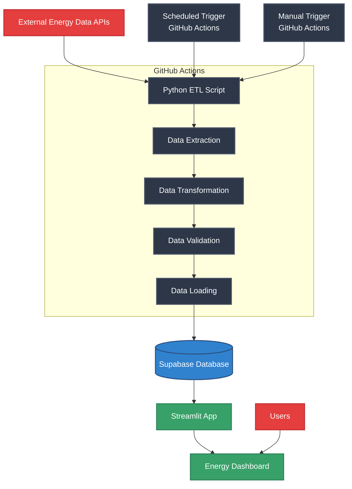

# How Renewable Is My Energy? ETL Pipeline

A Python-based proof-of-concept ETL pipeline that fetches real-time carbon intensity data from the National Grid ESO API and stores it in a Supabase database, with a Streamlit dashboard for visualization.

The dashboard is viewable here: https://how-renewable-uk.streamlit.app/

(May take a few seconds to initialize when the dashboard first loads. This is a limitation of Streamlit's free hosting)

## Automated Workflow

The pipeline runs hourly via GitHub Actions, with daily cleanup of old data (to stay witin free hosting limits).
In production, this would be replaced by something like Apache Airflow

    

## Project Structure

- `main.py` - ETL pipeline implementation
- `dashboard.py` - Streamlit dashboard
- `requirements.txt` - Python dependencies

## Run it yourself

1. Install dependencies:
   ```
   pip install -r requirements.txt
   ```

2. Create a `.env` file with your Supabase credentials:
   ```
   SUPABASE_URL=your_supabase_project_url
   SUPABASE_KEY=your_supabase_service_key
   ```

3. Run the ETL pipeline:
   ```
   python main.py
   ```

4. Start the dashboard:
   ```
   streamlit run dashboard.py
   ```
